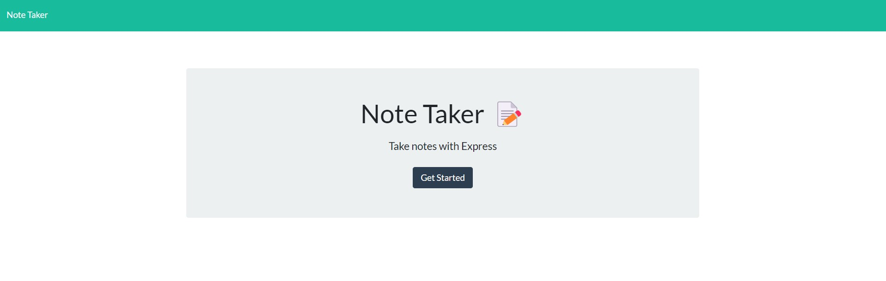

# Note Taker

## Description
The Note Taker application is a solution for small business owners to keep track of and organize thoughts and tasks that need to be completed. This application allows the user to write and save notes that can then be accessed by clicking on them in the left hand column.

## Table of Contents
* [Installation](#installation)
* [Usage](#usage)
* [Contributors](#contributors)
* [Tests](#tests)
* [Questions](#questions)
* [License](#license)

## Installation
There is no installation process other than accessing the link to the application. 

## Usage
You will be required to enter a title and description for each note.

## Contributors
Ryan Weiler

## Tests
No testing available at this time.

## Questions
* GitHub User Name: [ryanweiler92](https://github.com/ryanweiler92)
* Application Link: [Note Taker](https://sleepy-headland-66572.herokuapp.com/)
* For any additional questions please reach out to ryanweiler92@gmail.com.

## License
  